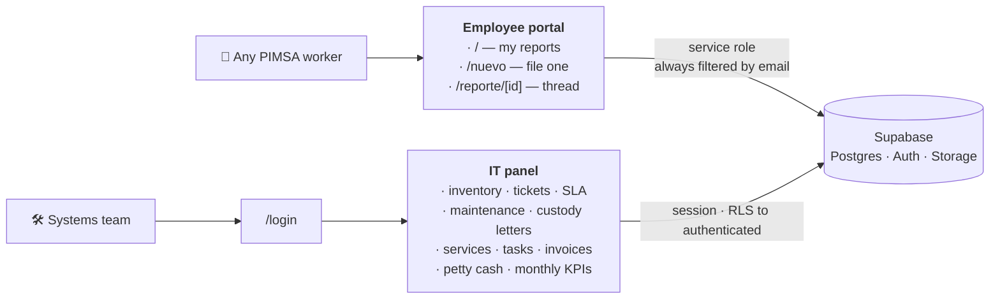

<div align="center">


# TI Hub

**The operational tool for the IT department of Plásticos PIMSA.**
Device inventory, maintenance, help-desk tickets with SLA, asset-custody letters,
systems status, invoices, petty cash and monthly KPIs — plus a friction-free
portal where any worker can report a problem.

[](https://github.com/LittlePitza/ti-hub/actions/workflows/ci.yml)
[](https://nextjs.org)
[](https://react.dev)
[](https://www.typescriptlang.org)
[](https://supabase.com)
[](#testing)
[](LICENSE)

</div>

---

## Two faces, one app

TI Hub is a single Next.js application over a single database, serving two very
different audiences.



|                 | Employee portal                | IT panel                            |
| --------------- | ------------------------------ | ----------------------------------- |
| **Routes**      | `/`, `/nuevo`, `/reporte/[id]` | `/ti/*` (+ `/login`)                |
| **Who**         | any worker at the plant        | the systems team                    |
| **Sign-in**     | none — an email in a cookie    | Supabase Auth (email + password)    |
| **Entry point** | it _is_ the home page          | the small "TI" in the portal footer |

The portal is deliberately frictionless: a worker never sees a password, IT
jargon or a metric. The panel is where the department actually works.

> [!NOTE]
> The UI is intentionally in **Spanish** — it is read by plant and office staff in
> Santa Catarina, N.L. Code, comments and documentation are in **English**. See
> [CONTRIBUTING.md](CONTRIBUTING.md) for the rule and the glossary.

## Stack

**Next.js 15** (App Router) · **React 19** · **TypeScript** in `strict` mode ·
**Supabase** (PostgreSQL + Auth + Storage) · deployed on **Vercel**.

Server Components by default. No Tailwind and no UI library: the design system is
hand-written CSS, and the charts are hand-rolled SVG. The only runtime
dependencies are Supabase, `nodemailer` and `sharp`.

## Getting started

### 1. Database

1. Create a project at [supabase.com](https://supabase.com) — the free plan is
   enough.
2. Open **SQL Editor → New query**, paste the whole of
   [`supabase/schema.sql`](supabase/schema.sql) and hit **Run**. That creates the
   16 tables, the indexes, the RLS policies, the three Storage buckets and — on a
   fresh install only — the sample data.
3. Under **Authentication → Users → Add user**, create the accounts for the IT
   team (email + password, tick **Auto Confirm User**). There is no public
   sign-up: only the users you add here can reach the panel.
4. Under **Project Settings → API**, copy the **Project URL**, the **anon public
   key** and the **service_role key**.

> [!WARNING]
> `schema.sql` is idempotent — `create table if not exists` plus an `ALTER`
> section for older databases. Do **not** re-run the `DATOS DE EJEMPLO` (sample
> data) section against real data.

### 2. Run locally

```bash
npm install
cp .env.example .env.local   # then fill in the three variables
npm run dev                  # http://localhost:3000
```

Requires Node 20 or newer (`.nvmrc` pins 22).

### 3. Deploy

1. Push the repository to GitHub.
2. At [vercel.com](https://vercel.com) → **Add New → Project** → import the repo.
   Vercel detects Next.js on its own; nothing to configure.
3. Add all three **Environment Variables**:

   | Variable                        | Exposed to the browser | Notes                                                          |
   | ------------------------------- | ---------------------- | -------------------------------------------------------------- |
   | `NEXT_PUBLIC_SUPABASE_URL`      | yes                    |                                                                |
   | `NEXT_PUBLIC_SUPABASE_ANON_KEY` | yes                    | RLS keeps it harmless on its own                               |
   | `SUPABASE_SERVICE_ROLE_KEY`     | **never**              | server-only, bypasses RLS; the portal does not work without it |

4. **Deploy.**

> [!TIP]
> Deploying without the two `NEXT_PUBLIC_` variables still builds and serves:
> every page shows a configuration notice instead of crashing. That is what CI
> relies on to build without a database.

Email notifications (SMTP, sender, templates, portal URL) are **not** environment
variables — IT configures them from the panel at `/ti/correo`. Same for the SLA
targets.

## Scripts

| Command              | What it does                                         |
| -------------------- | ---------------------------------------------------- |
| `npm run dev`        | Dev server on :3000                                  |
| `npm run build`      | Production build                                     |
| `npm run start`      | Serve the build                                      |
| `npm run lint`       | ESLint                                               |
| `npm run typecheck`  | `tsc --noEmit`                                       |
| `npm run test`       | Vitest — the domain suite                            |
| `npm run test:watch` | The same, in watch mode                              |
| `npm run format`     | Prettier, write                                      |
| **`npm run verify`** | **lint + typecheck + test + build — the whole gate** |

`npm run verify` is exactly what CI runs on every push and pull request, so a
green run locally is a green run there.

## Structure

Everything the app ships lives under `src/`; the root holds configuration and
documentation. The `@/*` alias resolves to `./src/*`.

```
src/
  middleware.ts            Requires a session on /ti/*, refreshes the token
  app/
    layout.tsx             Poppins, theme bootstrap, viewport
    globals.css            Ordered @imports of src/styles/
    login/                 Panel sign-in (Supabase Auth)
    (portal)/              Employee portal — public, cookie identity
      page.tsx               My reports
      nuevo/                 File a report (numbered steps)
      reporte/[id]/          Report detail + reply thread
    ti/                    IT panel — session required
      page.tsx               Dashboard (metrics, charts, alerts)
      inventario/            Devices, phones, lines, software (tabs by category)
      empleados/             Directory + email-signature generator
      mantenimientos/        Preventive/corrective scheduling
      tickets/               Help-desk cycle, SLA, board and list views
      responsivas/           Asset-custody letters (+ printable document)
      servicios/             Systems status and incidents
      tareas/                Tasks and projects
      facturas/              Invoices and vendors
      caja/                  Petty cash
      reportes/              Monthly KPI report
      correo/                Email + SLA configuration
  components/              By domain: ui, layout, charts, inventory,
                           tickets, custody, shared
  lib/
    supabase/client.ts     The three per-request Supabase clients
    domain/                Business rules per module (+ co-located tests)
    utils/                 Formatting, FormData, images, attachments, jsonb
  styles/                  Design system, eight files in a load-bearing order
  types/database.ts        Generated Supabase types

supabase/schema.sql        Full schema + RLS + buckets + seed — source of truth
docs/                      Architecture, roadmap, system documentation
```

Deeper detail — the three Supabase clients, the three security layers, every
domain module — lives in [`docs/architecture.md`](docs/architecture.md).

## Security

Three layers guard the IT panel, all requiring a Supabase Auth session:

1. **Middleware** — no valid session on `/ti/*` redirects to `/login`.
2. **Server actions** — verify the user via `getAuthenticatedSupabase()` _before_
   writing, never after. Actions are public POST endpoints; this is what stops an
   unauthenticated call.
3. **RLS** — every policy is `to authenticated`, so the anon key alone cannot read
   or write any table even if someone extracts it from the browser.

The employee portal at `/` is public. Its identity is an HttpOnly cookie holding
the employee's email; the server reads with the service-role key and **always
filters by that email**. RLS stays closed to `anon` — do not add public policies.

Users are managed by hand in the Supabase dashboard
(**Authentication → Users**). There is no sign-up page; that is deliberate for an
internal tool.

Full threat model, accepted trade-offs and how to report a vulnerability:
[`SECURITY.md`](SECURITY.md). **Never report one in a public issue.**

## Testing

```bash
npm run test
```

160 Vitest cases cover the pure domain modules in `src/lib`, co-located as
`*.test.ts`: the SLA clock and its pause, the payment projection and month-end
clamping, the petty-cash ledger, the derived service status, month arithmetic,
and the jsonb sanitisers. They need no database, so they run in under a second.

Server actions and pages are out of scope by design — `npm run build` verifies
those.

> [!IMPORTANT]
> Keys inside a jsonb column are **database identifiers** and stay in Spanish
> (`ExtraCredential.etiqueta`, `TemplateClause.texto`). Values cross into Postgres
> through `Json`, so renaming one type-checks perfectly and orphans every row
> already written. The tests are the only thing that catches it.

## Documentation

| Document                                                         | For                                       |
| ---------------------------------------------------------------- | ----------------------------------------- |
| [`docs/architecture.md`](docs/architecture.md)                   | How it is built and why                   |
| [`CONTRIBUTING.md`](CONTRIBUTING.md)                             | Language rules, conventions, the glossary |
| [`SECURITY.md`](SECURITY.md)                                     | Threat model and reporting                |
| [`docs/roadmap.md`](docs/roadmap.md)                             | What shipped, what is next                |
| [`docs/documentacion-sistema.md`](docs/documentacion-sistema.md) | Spanish manual for PIMSA staff            |
| [`CHANGELOG.md`](CHANGELOG.md)                                   | What changed, when                        |

## License

Proprietary — © Plásticos PIMSA, S.A. de C.V. All rights reserved. The source is
published for reference; it may be read but not used, copied or deployed. See
[`LICENSE`](LICENSE).
