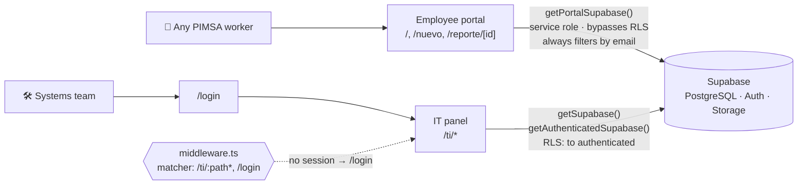

# Architecture

Internal IT site for **Plásticos PIMSA** (plastics recycling, Santa Catarina,
N.L.). One Next.js app and one database serving two audiences.

## Two faces, one app

|                 | Employee portal                      | IT panel                                                  |
| --------------- | ------------------------------------ | --------------------------------------------------------- |
| Routes          | `/`, `/nuevo`, `/reporte/[id]`       | `/ti/*` (+ `/login`)                                      |
| Source          | `src/app/(portal)/`                  | `src/app/ti/`                                             |
| Audience        | any PIMSA worker                     | the systems team                                          |
| Auth            | none — an email in a cookie          | Supabase Auth (email + password)                          |
| Supabase client | `getPortalSupabase()` (service role) | `getSupabase()` / `getAuthenticatedSupabase()`            |
| Entry point     | it _is_ the home page                | the small "TI" in the portal footer, pointing at `/login` |

The portal is deliberately frictionless: a worker never sees IT jargon, a
password, or a metric. The panel is the operational tool for the department.



## Stack

Next.js 15 (App Router) + React 19 + TypeScript in `strict` mode.
**Server Components by default**; `"use client"` appears only where there is
genuine interactivity (theme toggle, charts, ticket board, modals, pickers,
drag-and-drop).

No Tailwind, no UI library. All styling is hand-written CSS in `src/styles/`,
themed through CSS variables with `[data-theme="dark"]` overrides. Charts are
hand-rolled SVG in `src/components/charts/Charts.tsx`. The only runtime
dependencies are Supabase, `nodemailer` and `sharp`.

## Layout

```
src/
  app/            routes — the two faces plus /login
  components/     grouped by domain: ui, layout, charts, inventory,
                  tickets, custody, shared
  lib/
    supabase/     the three per-request clients
    domain/       business rules, one module per area (+ co-located tests)
    utils/        formatting, FormData, images, attachments, jsonb
  styles/         the design system, split into eight ordered files
  types/          generated Supabase types
  middleware.ts   session gate for /ti/*
supabase/         schema.sql — the source of truth
docs/             this file, the roadmap, the system documentation
```

The root holds only configuration and documentation. `@/*` resolves to `./src/*`.

## The three Supabase clients — never a singleton

Defined in `src/lib/supabase/client.ts`. The session differs per request, so the
client is built per request and bound to cookies via `@supabase/ssr`.

```
getSupabase()               reads in panel Server Components
                            -> null when env vars are missing (renders NoConnection)

getAuthenticatedSupabase()  panel server actions
                            -> null when there is no user; actions check BEFORE writing
                            -> uses getClaims(), which verifies the JWT locally with the
                               project asymmetric key: no network round-trip, unlike getUser()

getPortalSupabase()         the employee portal only
                            -> uses SUPABASE_SERVICE_ROLE_KEY and BYPASSES RLS
                            -> therefore must ALWAYS filter by solicitante_email / asignado_email
                            -> must never reach the client
```

## Security: three layers

1. **`src/middleware.ts`** requires a session on `/ti/*` and redirects to
   `/login`; it also refreshes the session token. The matcher is deliberately
   narrow (`/ti/:path*`, `/login`) so portal traffic never invokes it. It uses
   `getUser()`, which validates the JWT against Supabase, because `getSession()`
   cannot be trusted at the edge.
2. **Server actions** verify the user with `getAuthenticatedSupabase()` before
   any write. Actions are public POST endpoints; this is what stops an
   unauthenticated invocation. `src/app/ti/layout.tsx` adds a second render-time
   check.
3. **RLS in Postgres** — every policy is `to authenticated`. The anon key on its
   own reads nothing, even if extracted from the browser.

There is no public sign-up. IT users are created by hand in the Supabase
dashboard.

The portal identity is a cookie (`src/lib/domain/portal.ts`: `portal_correo`,
HttpOnly, 180 days). **Accepted trade-off:** anyone who knows a colleague's
email address could see their reports. This is an internal portal and zero
friction was the priority. RLS stays closed to `anon` — do not add public
policies. See [`../SECURITY.md`](../SECURITY.md).

## The database is code

`supabase/schema.sql` is the source of truth: 16 tables, indexes, RLS policies,
three Storage buckets (`responsivas`, `tickets`, `facturas`) and seed data.

```
empleados              equipos                mantenimientos
tickets                ticket_eventos         campos_inventario
responsivas            plantillas_responsiva  config_correo
servicios              incidentes             tareas
proyectos              facturas               proveedores
caja_movimientos
```

The file is **idempotent**: `create table if not exists` plus an `ALTER` section
for older databases. The "DATOS DE EJEMPLO" section is for fresh installs only —
never re-run it over real data.

Apply a schema change by writing the DDL into this file _and_ applying it to the
remote project via the Supabase MCP (`apply_migration`). Then regenerate
`src/types/database.ts`.

Several states are **derived rather than stored** — a deliberate pattern:

- a service status derives from its open incidents,
- an invoice is `vencida` by comparing its due date to now,
- a task is done when `completada_at` is stamped,
- the whole monthly report derives from existing timestamps.

Because the timestamps are immutable, any closed month can always be
reconstructed. That is why there are no snapshot tables.

## Domain modules in `src/lib/domain/`

Reuse these before writing anything new. Each has a co-located `*.test.ts`.

**`inventory.ts`** — inventory is a **single `equipos` table** partitioned by
`categoria` (`computo` | `celular` | `linea` | `software`). Generic columns
change meaning per category — `marca` is the phone carrier on a line, for
instance — and the per-category labels and visible fields are declared here. A
line or phone with no `asignado_email` is _free_. Also holds the sanitisers for
the two jsonb columns: `sanitizeCredentials` (`equipos.accesos`) and
`sanitizeCustomFields` (`equipos.extras`).

**`tickets.ts`** — statuses (a help-desk cycle: `abierto`, `en_proceso`,
`en_espera`, `resuelto`, `cerrado`, `reabierto`, `archivado`), priorities,
categories and **SLA per priority** (response and resolution, in hours).
`SLA_DEFAULTS` are the ITIL-4 baselines, but IT overrides them from `/ti/correo`
(the `sla_*` columns of `config_correo`). `resolveSla(config)` in `email.ts`
merges overrides over the defaults and feeds `evaluateResponse` /
`evaluateResolution`, which compute the indicator (met / on time / due soon /
breached / paused). `en_espera` pauses the clock.

**`custody.ts`** — custody letters (`responsivas`), the legal document by which
an employee takes charge of an asset. The **8 base templates live in code**
(`DEFAULT_TEMPLATES`); the `plantillas_responsiva` table stores only the
overrides IT edits, merged by `mergeTemplate`. Each letter stores a **frozen
snapshot** of the employee and the device (`deviceSnapshot`), so it does not
change retroactively when either record is later edited.

**`email.ts`** — notifications, **configured from the panel** (`/ti/correo`,
table `config_correo`), not from environment variables. Three send methods:
`smtp_basico`, `graph_app` (Microsoft Graph, app-only) and `oauth_interactivo`.
Sending is triggered by IT on demand — the one exception is the new-ticket
notice, which is automatic. `config_correo` is also the single configuration row
for the panel as a whole, which is why `resolveSla` lives alongside it.

**`reports.ts`** — the monthly KPI cut for `/ti/reportes`. Standard help-desk
cohorts: _created_ (`created_at` in the month), _responded_
(`primera_respuesta_at`, giving the response SLA), _resolved_ (`resuelto_at`,
giving the resolution SLA) and _backlog at close_. Plus incident overlap with the
month, per-service availability, maintenance completion and variation against the
previous month. Entirely derived; for the current month the cut is "now".

**`invoices.ts`** — invoices and vendors. The payment schedule **materialises
nothing**: future vendor due dates are projected at render time from the
`proximo_pago` anchor and the recurrence (`projectVendorDues`). The only write
happens when IT records a payment: the action creates the real invoice and
advances the anchor with `addMonths()`, which clamps to the end of the target
month.

**`services.ts`** — the systems-status catalogue and its incidents. A service
status is **derived** from its open incidents (`serviceStatus`), never stored;
the highest-ranked active incident wins.

**`tasks.ts`** — tasks and projects. A task is done when `completada_at` is
stamped; overdue is derived from `fecha_limite`. `groupPending` sorts the list
into the five due-date buckets.

**`pettyCash.ts`** — an imprest ledger. The balance is pure arithmetic:
`limit − purchases + reimbursements`. Nothing is marked reimbursed row by row.

**`portal.ts`** — portal identity plus the mappings into employee-facing
language (categories, and statuses reduced to a 3-step `step`).

**`signature.ts`** — the email-signature generator. A pure function producing
email-safe HTML (a table with inline styles), used by both the server and the
live client preview.

**`../utils/format.ts`** — folios (`ticketFolio` giving `TK-####`, plus the
custody-letter, incident and invoice variants), dates and durations. All
formatting goes through here.

## Cross-cutting details

- **Mutations are Server Actions** in an `actions.ts` beside each page: verify
  session, write, then `revalidatePath`.
- **Folios** are a prefix plus `num` (a Postgres serial), padded in
  `src/lib/utils/format.ts`.
- **Statuses** have `check` constraints in the database and map in the UI to
  `.insignia.ok|aviso|critico|info|neutro`.
- **Ticket activity log** (`ticket_eventos`) holds internal comments, replies to
  the requester and messages from the requester — a two-way thread with the
  portal. Internal notes are never exposed to the portal.
- **The base URL is not written anywhere in the code.** It is derived from the
  proxy headers (`x-forwarded-host`); email links use `config_correo.sitio_url`,
  set from the panel. Changing domain requires no code change.
- **Image handling**: report photos are compressed in the browser before upload,
  and again with `sharp` on archive. `sharp` is a native module, kept out of the
  server bundle via `serverExternalPackages` so it loads its binary directly. The
  Server Action body limit is raised to 12 MB for the same reason.
- **No Content-Security-Policy header** — the root layout uses an inline script
  for the theme (to avoid a white flash before first paint) and inline styles. A
  strict CSP would break both without a per-request nonce. Every other security
  header is set in `next.config.mjs`.
- **jsonb keys are database identifiers.** A shape persisted into a jsonb column
  keeps its stored key names, in Spanish, even where the surrounding code is
  English: `ExtraCredential.etiqueta`, `TemplateClause.texto`, `Attachment.nombre`.
  Renaming one orphans every row already written, and the compiler cannot warn
  you, because the value crosses through `Json`.

## Testing

`npm run test` runs Vitest over the pure domain modules — the SLA clock, the
payment projection, the petty-cash ledger, the derived service status, the month
arithmetic and the jsonb sanitisers. They need no database, so they stay fast.

Anything requiring Supabase, cookies or the network (server actions, pages) is
out of scope by design: `npm run build` is what verifies those.

`npm run verify` runs the whole gate — lint, typecheck, tests, build — which is
exactly what CI does on every push and pull request.

## Visual language

TI Hub mirrors the PIMSA Portal de Mantenimiento: navy chrome `#15273a` (sidebar
and login), mist background `#f2f4f7`, flat floating surfaces with generous
corners (`--radio-campo` 12px, `--radio-tarjeta` 16px, `--radio-pastilla`) and
soft shadows (`--sombra-tarjeta`, `--sombra-pop`). No gradients. Utilities:
`.press` for tactile feedback, `.eyebrow` for uppercase labels. The light/dark
toggle is preserved throughout.

Brand tokens: `--pimsa-azul` `#294466`, `--pimsa-verde` `#7F9D41`,
`--pimsa-verde-claro` `#B0CD75`, `--pimsa-azul-profundo` `#064D79`. Typography is
Poppins across both faces.
